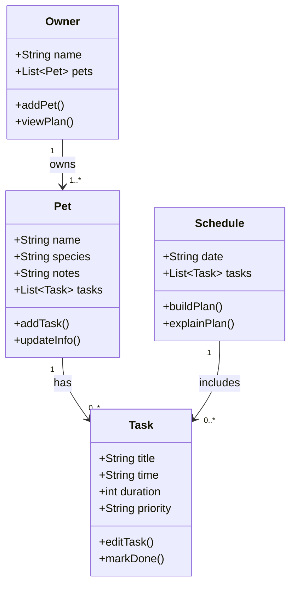

# PawPal+ Project Reflection

## 1. System Design

**a. Initial design**

- I started with Owner, Pet, Task, and Schedule.
- Owner stores the owner and their pets.
- Pet stores the pet info and its tasks.
- Task stores what needs to happen, when, and how often.
- Schedule holds the plan for the day.

**Class brainstorm**

- Owner: keeps the owner name and pet list.
- Owner: can add pets and view the plan.
- Pet: keeps the pet name, species, and notes.
- Pet: can update its info and show tasks.
- Task: keeps the task time and frequency.
- Task: can be edited or marked done.
- Schedule: holds the daily task list.
- Schedule: can sort and build the plan.

**b. Design changes**

- I linked each task to a pet so the plan clearly shows who it belongs to.
- I sorted tasks by time so the day feels more natural.

---

## 2. Scheduling Logic and Tradeoffs

**a. Constraints and priorities**

- What constraints does your scheduler consider (for example: time, priority, preferences)?
- How did you decide which constraints mattered most?

**b. Tradeoffs**

- The scheduler only checks for exact time matches when it looks for conflicts.
- This is simple and fast, and it is good enough for a small pet care app.

---

## 3. AI Collaboration

**a. How you used AI**

- I used the AI assistant to brainstorm the design, sketch the scheduler methods, and fix small Python issues.
- The most useful part was getting quick suggestions without overcomplicating the system.
- I also used it to improve the pytest cases and make the behavior easier to verify.

**b. Judgment and verification**

- I rejected one suggestion that made the scheduler feel too abstract too early.
- I kept it simpler and verified the change with tests.
- Using separate chat sessions helped me stay organized by keeping design, coding, and testing in their own lane.

**c. AI Strategy Reflection**

- The most useful feature was getting focused help on one part at a time, like recurrence or conflict logic.
- I changed one suggestion to keep the classes simpler and easier to follow.
- I learned that being the lead architect means guiding the AI, not just accepting whatever it gives you.

---

## 4. Testing and Verification

**a. What you tested**

- What behaviors did you test?
- Why were these tests important?

**b. Confidence**

- How confident are you that your scheduler works correctly?
- What edge cases would you test next if you had more time?

---

## 5. Reflection

**a. What went well**

- What part of this project are you most satisfied with?

**b. What you would improve**

- If you had another iteration, what would you improve or redesign?

**c. Key takeaway**

- What is one important thing you learned about designing systems or working with AI on this project?
